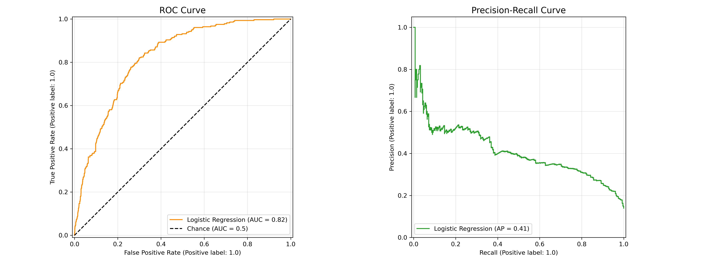
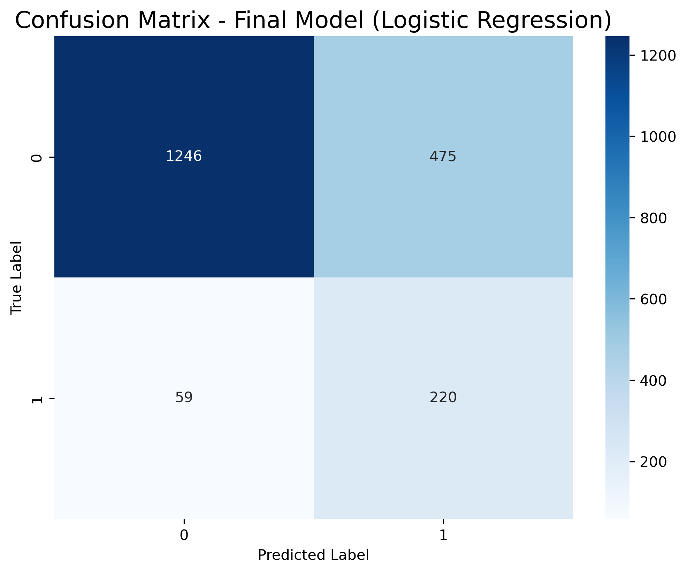
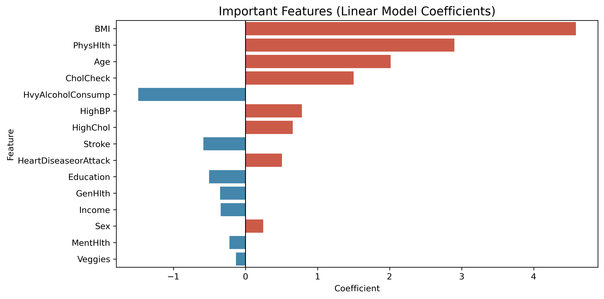

# Diabetes Risk Prediction: Optimizing Recall for Medical Screening


## About The Project

This project implements a Machine Learning pipeline to predict diabetes risk using the **CDC Health Indicators dataset**. 

In a medical screening context, the cost of missing a positive case (False Negative) is significantly higher than a False Alarm. Therefore, this project prioritizes **Recall (Sensitivity)** over Precision to ensure that the majority of at-risk patients are identified for further testing.

**Key Objective:** Maximize the detection of diabetic patients in a highly imbalanced dataset.

### Key Features
* **Imbalanced Data Handling:** extensive use of **SMOTE** and **Undersampling** techniques to balance classes.
* **Metric Optimization:** Model tuning focused on the Precision-Recall trade-off rather than simple Accuracy.
* **Interpretability:** Analysis of key risk factors (BMI, Age, Blood Pressure) to validate medical relevance.

---

## Methodology & Results

The pipeline includes Exploratory Data Analysis (EDA), feature engineering, and a comparison of multiple models. The final model (Logistic Regression with Hybrid Resampling) was optimized specifically for high sensitivity.

### Performance Visuals

The model demonstrates robust detection capabilities for the positive class (Diabetic).

**1. Trade-off Analysis (ROC & Precision-Recall)**
The curves below confirm that achieving high Recall (>75%) mathematically requires accepting lower Precision (~30%) in this specific medical context.

<p align="center">
  
</p>

**2. Confusion Matrix**
As seen below, the model minimizes False Negatives (bottom-left quadrant), ensuring most diabetic patients are flagged for further testing.

<p align="center">
  
</p>

**3. Key Risk Factors**
The model identified BMI, Age, and High Blood Pressure as the top predictors, aligning with medical literature.

<p align="center">
  
</p>

> **Note:** See the full technical report in `docs/project_report.pdf` or the notebook `notebooks/diabetes_prediction_modeling.ipynb`.

---

## Project Structure

```bash
diabetes-risk-prediction-ml/
├── docs/                   # Project documentation (PDF report)
│   └── diabetes_prediction_modeling.ipynb
├── images/                 # Plots and confusion matrices
├── notebooks/              # Jupyter Notebooks with the analysis
│   └── diabetes_prediction_modeling.ipynb
├── README.md
└── requirements.txt
```

---

## Getting Started

To run this project locally, follow these steps:

1. **Clone the repository**
   ```bash
   git clone [https://github.com/drivash/diabetes-risk-prediction-ml.git](https://github.com/drivash/diabetes-risk-prediction-ml.git)
   ```

2. **Install dependencies**
   ```bash
   pip install -r requirements.txt
   ```

3. **Run the analysis**
   Open the main notebook to see the code and results:
   ```bash
   jupyter notebook notebooks/diabetes_prediction_modeling.ipynb
   ```

---

## Author

**Daniel Rivas Hidalgo** Data Science & AI Student @ UPM  

* **LinkedIn:** [Daniel Rivas Hidalgo](https://www.linkedin.com/in/drivash05/)
